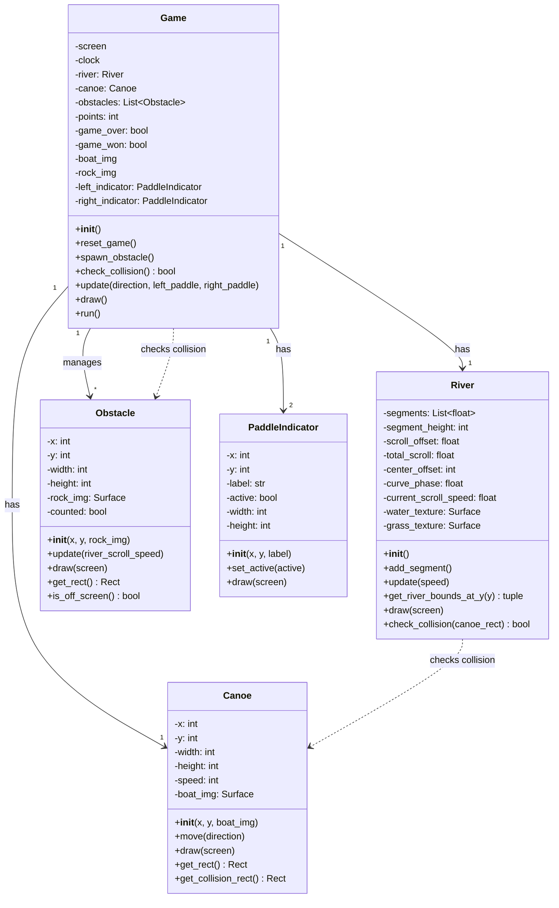
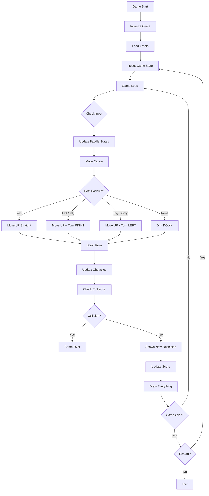

# Game Architecture - test_run_game.py

## Overview

This document describes the architecture of the canoe rowing game, which uses IoT paddle sensors to control a canoe navigating through obstacles in a river.

## Class Diagram



## Class Descriptions

### Game
**Main game controller** that orchestrates all game components and manages the game loop.

- Initializes Pygame, loads assets (boat and rock images)
- Manages game state (points, game_over, game_won)
- Handles game loop, update logic, and rendering
- Spawns obstacles at regular intervals
- Checks collisions between canoe, obstacles, and river banks
- Displays UI elements (score, paddle indicators, game over screen)

### River
**Dynamic river environment** with curved banks and scrolling textures.

- Generates S-curved river path using sinusoidal functions
- Manages river scrolling (moves up when rowing, down when drifting)
- Draws animated water and grass textures
- Provides river boundary information for collision detection
- Tracks scroll offset for smooth texture animation

### Canoe
**Player-controlled boat** that moves through the river.

- Handles horizontal movement (left/right)
- Vertical position controlled by Game based on paddle input
- Draws boat sprite or fallback rectangle
- Provides both full rect and smaller collision rect for accurate hit detection

### Obstacle
**Rocks spawned in the river** that the player must avoid.

- Moves with river scroll speed (fixed to river coordinate system)
- Draws rock sprite or fallback rectangle
- Tracks whether it has been counted for scoring
- Removes itself when off-screen

### PaddleIndicator
**Visual feedback** showing which paddles are active.

- Displays LEFT/RIGHT paddle status at top of screen
- Changes color based on active state (green = active, gray = inactive)
- Provides real-time feedback to player

## Game Flow



## Control Logic

### Input Mapping
- **UP Arrow**: Both paddles active → Canoe moves UP (straight)
- **LEFT Arrow**: Left paddle only → Canoe moves UP and turns RIGHT
- **RIGHT Arrow**: Right paddle only → Canoe moves UP and turns LEFT
- **No Input**: No paddles → Canoe drifts DOWN with current

### Vertical Movement
- **Rowing** (any paddle active): Canoe moves upward at `UPSTREAM_SPEED` (3 px/frame), river scrolls down
- **Drifting** (no paddles): Canoe drifts downward at `DOWNSTREAM_DRIFT` (1.5 px/frame), river scrolls up
- **Boundary**: Canoe cannot go above middle of screen (y = 300)

### Horizontal Movement
- **Left paddle**: Canoe moves right at `CANOE_SPEED` (5 px/frame)
- **Right paddle**: Canoe moves left at `CANOE_SPEED` (5 px/frame)
- **Both paddles**: No horizontal movement (straight)

### Scoring
- **+1 point** each time an obstacle passes below the canoe
- Obstacles marked as "counted" to prevent double-counting

### Game Over Conditions
1. Collision with obstacle (rock)
2. Collision with river bank
3. Canoe reaches bottom of screen (y + height ≥ 600)

## Constants

| Constant | Value | Description |
|----------|-------|-------------|
| SCREEN_WIDTH | 800 | Window width in pixels |
| SCREEN_HEIGHT | 600 | Window height in pixels |
| FPS | 60 | Target frame rate |
| CANOE_WIDTH | 55 | Boat sprite width |
| CANOE_HEIGHT | 100 | Boat sprite height |
| CANOE_SPEED | 5 | Horizontal movement speed |
| UPSTREAM_SPEED | 3 | Upward speed when rowing |
| DOWNSTREAM_DRIFT | 1.5 | Downward drift speed |
| RIVER_WIDTH | 400 | Width of playable river |
| OBSTACLE_WIDTH | 80 | Rock sprite width |
| OBSTACLE_HEIGHT | 80 | Rock sprite height |
| SPAWN_INTERVAL | 2000 | Milliseconds between obstacle spawns |

## Integration Points for IoT

The game is designed to integrate with BLE paddle sensors:

1. **Current**: Keyboard input in `Game.run()` (lines 484-536)
2. **Future**: Replace keyboard polling with BLE data from Thingy:52 devices
3. **Interface**: `update(direction, left_paddle, right_paddle)` method (line 375)
   - `direction`: "LEFT", "RIGHT", "STRAIGHT", or "STOP"
   - `left_paddle`: boolean (True = left paddle active)
   - `right_paddle`: boolean (True = right paddle active)

### BLE Integration Pattern
```python
# Pseudocode for BLE integration
while running:
    # Get paddle states from BLE
    left_paddle = ble_left_device.is_paddling()
    right_paddle = ble_right_device.is_paddling()

    # Determine direction
    if left_paddle and right_paddle:
        direction = "STRAIGHT"
    elif left_paddle:
        direction = "RIGHT"
    elif right_paddle:
        direction = "LEFT"
    else:
        direction = "STOP"

    # Update game
    game.update(direction, left_paddle, right_paddle)
    game.draw()
```

## File Structure

```
game/
├── test_run_game.py       # Main game file (this architecture)
├── images/
│   ├── boat.png           # Canoe sprite
│   ├── rock.png           # Obstacle sprite
│   ├── water.png          # Water texture (tiled)
│   └── grass.png          # Grass texture (tiled)
└── sounds/                # (Future: sound effects)
```
